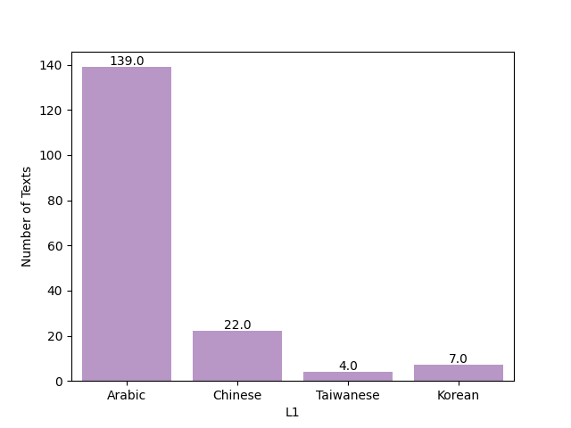
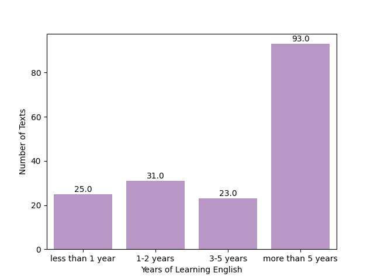
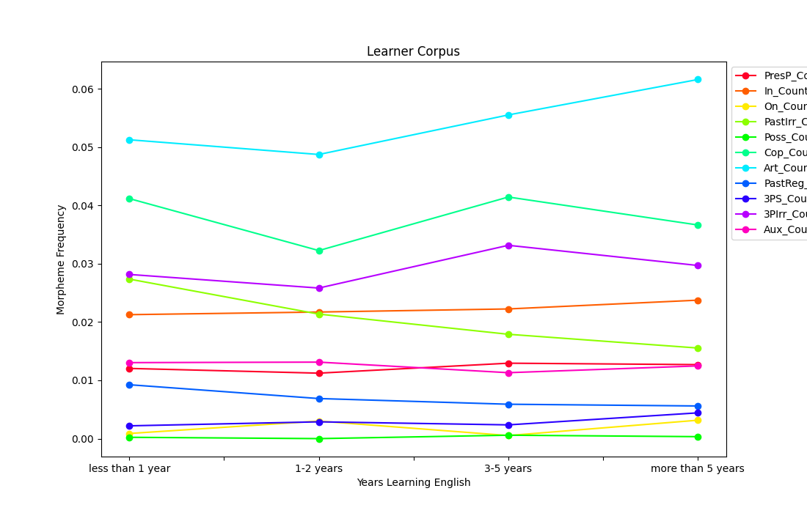
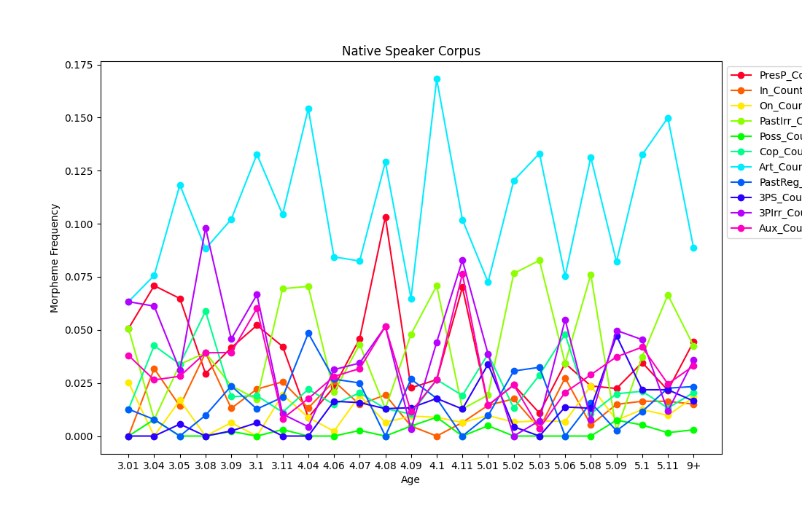
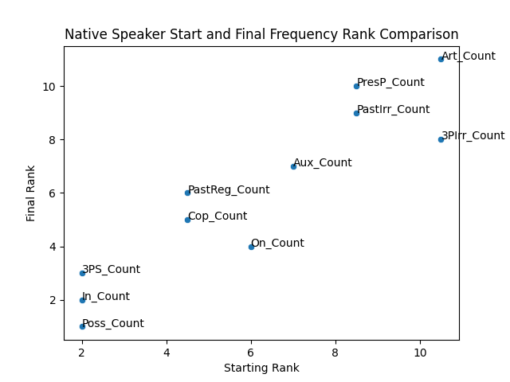
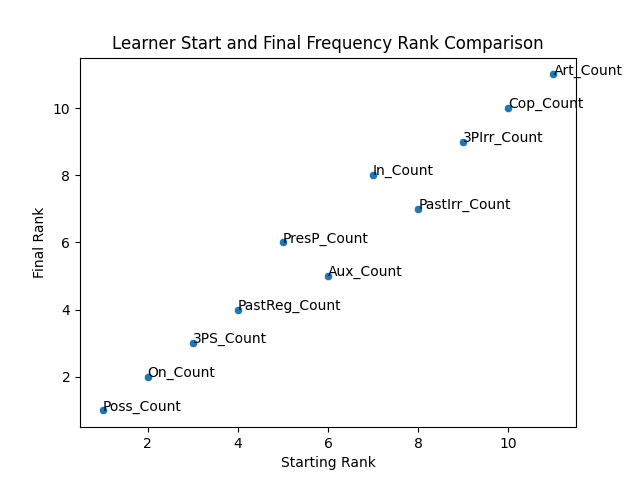
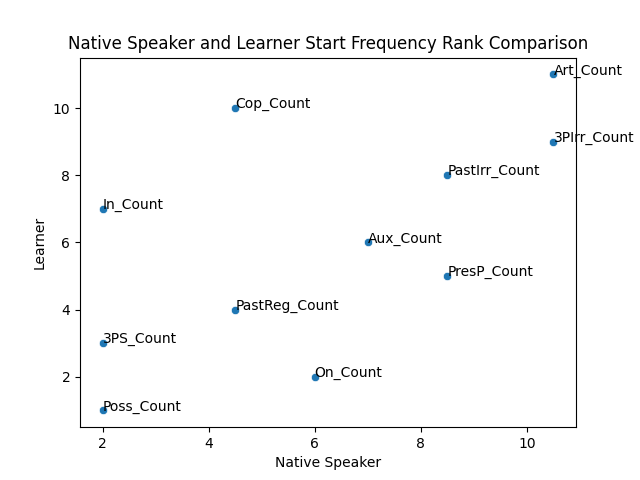
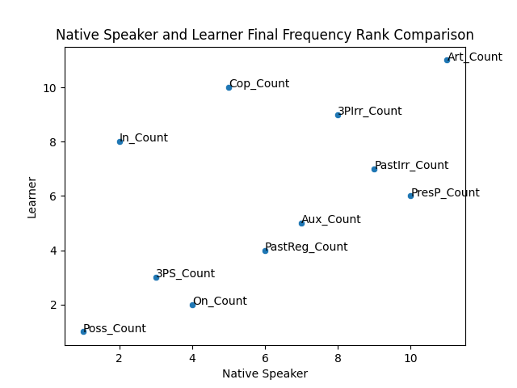

Final report
================
by Sen Sub Laban

## Contents
> <a href="#introduction" id="toc-introduction">Introduction</a>
> 
> <a href="#data-language-of-conspiracy-loco-corpus"
>    id="toc-data-language-of-conspiracy-loco-corpus">Data</a>
>
> <a href="#analysis" id="toc-analysis">Analysis</a>
>
> <a href="#process-reflection" id="toc-process-reflection">Process
>   reflection</a>
>
> <a href="#references-and-further-reading"
    id="toc-references-and-further-reading">References and further
    reading</a>

## Introduction

 This project was conducted as an analysis of morpheme acquisition order. Many 'natural order' studies proclaim that there is a consistent order in which language learners acquire proficiency in the use of grammatical morphemes. To understand this, it is important to make the distinction between lexical and grammatical morphemes. In the word *played*, there is a lexical morepheme (*play*) and a grammatical morpheme (*-ed*). The field of natural order studies, and this project, is primarily concerned with the latter type, which are also known as functors. The terms functor and morpheme are used interchangeably in this project. 
 
 Natural order studies originated in the 1970's when researchers were looking into the "independent grammars assumption," that is, the perspective that when children acquire their first language, they begin as speakers of their own personal languages rather than as defective speakers of the adult version of the language. The first of many studies of this kind was Brown's (1973) longitudinal study of three native American-English speaking children. Brown observed that children learn English morphemes in the same order, though not at the same age. The work of Brown (1973) and other first language researchers was extended to second language acquisition to demonstrate that SLA is not just a matter of learned responses but that competence is actually developed according to a predictable series of benchmarks. Various studies in SLA supported researchers' expectations that the order of morpheme acquisition is largely consistent across language learners, and also revealed that children and adult learners acquire morphemes in the same general order. Such studies have been largely influential in the field until the present day.

 Curious to see if proposed 'natural orders' of morpheme acquisition could be analyzed through corpora, I formulated this project. My questions are as follows: (1) Does the sequence of morpheme acquisition in the data align with previously proposed acquisition orders? and (2) How does acquisition potentially differ between first langauge (L1) and second langauge (L2) corpora? 

## Data
The data utilized in this project was mostly sourced from [TalkBank](https://talkbank.org/). TalkBank is a multilingual database focused on research in the study of human communication. It provides repositories in 14 research areas, including child langauge acquisition ([CHILDES](https://childes.talkbank.org/)) and second language acquisition ([SLABank](https://slabank.talkbank.org/)). I used corpora from these two collections in order to conduct my analysis. The L1 data I selected was Berman & Slobin's (1994) [Frog Story corpus](https://childes.talkbank.org/access/Frogs/English-Slobin.html), which consists of recorded narratives of 12 different native English speakers telling a wordless "frog story" from a picture book. Each speaker was recorded at several different age levels (3, 4, 5, 9, and 20), making it suitable for looking into morpheme usage over time. The L2 corpus is the Vercelloti corpus from SLABank, which consists of reocrdings from learners witha variety of L1's and varying levels of English proficiency. 

The transcripts in TalkBank databases are stored in a dedicated format known as CHAT. A Python library, [PyLangAcq](https://pylangacq.org/), was used to import and parse the CHAT data files. The structure of the CHAT data and process of importing said data can be seen [here](https://nbviewer.org/github/Data-Science-for-Linguists-2023/Morpheme-Acquisition-Analysis/blob/main/notebooks/data_curation.ipynb#importing-native-corpus). Utilizing PyLangAcq to extract the data that I needed from the CHAT files, I created two separate dataframes, one for native English speakers and another for English langauge learners, which are stored in [this folder](../data_samples). The CHAT files provided tokens as well as annotations for morphemes and part-of-speech (POS), which I extracted and added to respective columns. 

A major roadblock in the process of acquiring my data was that the Vercelloti corpus CHAT files did not contain crucial learner metadata, such as the years spent learning English, that was necessary for my analysis. I was able to resolve this because Vercelloti's corpus is actually sourced from [PELIC](https://eli-data-mining-group.github.io/Pitt-ELI-Corpus/). I was able to successfully [create a csv file](https://nbviewer.org/github/Data-Science-for-Linguists-2023/Morpheme-Acquisition-Analysis/blob/main/notebooks/data_curation_cont.ipynb#augmenting-the-l2-metadata) that maps the Vercelloti corpus participant ids to the PELIC anonymized ids and used it to import the necessary information about the subjects into my larger dataframe. The demographic data of the learners in the L2 corpus are visualized below. 

The majority of the subjects are Arabic speakers, with a few Chinese, Taiwanese, and Korean L1 speakers. In addition, most have been learning English for more than 5 years. However, there are sufficient learners who have been learning English for less amounts of time to be able to draw some analysis.

## Analysis
Once all the data was in order, I began my analysis. Researchers typically measure morpheme acquisition order by suppliance in obligatory context (SOC). To quote Brown (1973): 
>*Grammatical morphemes are obligatory in certain contexts, and so one can set an acquisition criterion not simply in terms of output, but in terms of output-where-required. Each obligatory context can be regarded as a kind of test item which the child passes by supplying the required morpheme or fails by supplying none or one that is not correct. This performance measure, the percentage of morphemes supplied in obligatory contexts, should not be dependent on the topic of conversation or the character of the interaction.*

The complexity of creating a model to actually measure SOC using Python would be beyond the scope of this project (at least with my current coding abilities), so I went about analysis in another way: by comparing the normalized frequencies of selected morphemes at each age or stage of acquisiton across the corpora. Of course, this introduces the issue of these count frequencies representing *any* occurence of a given morpheme, including incorrect or erroneous suppliances. Because it also includes incorrectly supplied morphemes, it is not as robust as an analysis of suppliance in obligatory context.

Functions to compile and count the occurence of 11 functors, selected from those investigated by Brown (1973), were run across both dataframes. The morpheme counts were normalized by dividing the counts by text length. Then, I calculated the means of the counts for each morpheme and level and stored that data in two new dataframes, which can be found in [data_samples](../data_samples). At first glance, it was challenging to parse the dataframes, so the line graphs below were generated in order to visualize any potential patterns.

In these graphs, the legend is ordered according to the proposed natural order of acquisition of morphemes. As such, we would expect to see functors at the top of the list, such as PresP, In, On, PastIrr, and so on, with higher frequencies earlier on, at the start of the x-axis. Functors acquired later, such as Aux_Count, 3PIrr, and 3PS, should demonstrate the opposite tendency, starting off with a 0 or near 0 frequency and emerging farther along the x-axis as learners progress in the time spent learning English. 

The data in this case does not appear to follow the predicted pattern. This may be due to a variety of factors such as the nature of the speaking task, the topic, semantic complexity, input frequency,L1 influence, or the type of academic instruction learners have received in their English program that may have prioritized particular forms over others.

However, there are many other interesting patterns that are presented by this graph. For example, articles start off quite frequent and become even more frequent as learners progress, indicating that articles, despite their frequency in the English language, take learners quite a long time to master. Copula and third-person irregular appear to mirror each other in their frequency throughout language development. In addition, the learners start off using the past irregular quite frequently, and it steadily drops throughout the years of learning. This may be because as the learners acquire additional aspects and tenses and their lexicon expands, they no longer need to rely on common, irregular verbs expressed in the simple past. There are likely even more observations that can be drawn from this data.

The native speaker data also does not appear to follow a clear, predictable pattern of development. More peaks and valleys of frequency can be observed but this does not necessarily indicate a difference in the pattern or nature of acquisition between L1 and L2 learners. This can be attributed to the differences in the x-axes, which are not to scale, and with the L1 corpus having significantly more specific time points, detailed by the subjects age in year and months rather than general categories of the number of years spent learning English. 

Even so, there are a few observations we can draw from this graph. It appears that while the frequencies of morphemes fluctuate quite a bit throughout the stages of acquisition, at the start and end their frequencies are more or less similar. In order to understand this, I generated a dataframe comparing the orders of frequency ranking at the start and end of the timespan detailed by the corpora to compare the differences within and between the L1 and L2 groups.

The rank comparison data can be viewed [here](data_samples/rank_comparison.csv). From the dataframe above, we can draw further conclusions. For example, native speakers start out at age 3.01 using articles and third-person irregular the most frequently, while by age 9 and older, present perfect and past irregular have become more common than third person irregular. 

English learners start out using articles, present perfect, and past irregular most frequently. Once the learners have spent 5 or more years learning English, articles remain frequent, but the copula and third person irregular become much more prevalent. Again, this is just the start of the potential observations and analysis that can be drawn from the data. The scatterplots below visualize the ranking comparison between and within L1 and L2 groups at the start and finish of the timespan detailed in their respective corpora. 

Finally, in order to verify mathematically the extent to which order of freqency ranks are different, I utilized a Ranked Biased Overlap (RBO) test, proposed by Weber et al. (2010). An RBO score indicates the percentage of similarity between the ranking of the order of frequency. Therefore, it seems that the ranking of the most frequent morphemes that native English speakers use at age 3 are 25% similar to the ranking of the most requent morphemes at ages 9+. Therefore, 75% dissimilar, meaning that the learners have certainly acquired additional morphemes and are using them to varying degrees. The learner start rank and learner final rank are much more similar to each other at about 69%. So, despite acquiring additional morphemes, it appears that they produce the morphemes at similar frequencies at the starting point of less than 1 year learning English to the final point of learning English for 5+ years. The native start rank compared to the learner start rank is the smallest percentage, at 19%, meaning the order ranking of frequency at which the learners and native speakers use particular morphemes is quite dissimilar. This may be due to the scope or timelines of the respective corpora throughout stages of acquisition, or perhaps the influence of language instruction on the learners. Finally, it seems that the native final rank and learner final rank are much more similar than their starting rank. So, perhaps despite starting with a somewhat different arsenal of morphemes they are able to produce frequently, they follow some sort of similar developmental pattern towards later stages of acquisition.

## Conclusion

In conclusion, it appears that the order of morpheme acquisition and how it differs between native speakers and language learners is quite a complex issue. At this point, it is difficult to draw robust generalizations that answer the research questions that this project set out to investigate. The analysis of the data does appear to suggest that there are differences between the order and developmental pattern of morphemes between native speakers and learners, but how exactly it differs and why is currently unclear. However, I do believe this project has provided a unique perspective and approach to these questions as well as the ability to offer new insights on the developmental pattern of morphemes. There is still an abundance of work that can be done utilizing the data curation and analysis conducted in this project. Potential avenues for further analysis might include digging deeper into the data to investigate specific morphemes rather than surveying a larger number of them. In addition, the morpheme frequencies calculated from these corpora could be compared to other, more wide-scale corpora to compare populations of learners to other populations of speakers.

## Process reflection

There were various challenges I encountered throughout this semester-long project. The first that became apparent was the difficulty in locating appropriate, publicly available data, especially for the language learner population. Longitudinal, large-scale, and transcribed spoken learner data is quite difficult to come by. I started the project intending to use one corpus, but had to change over to another due to the sparsity of the data. However, even once I had found new data to work with, it was still incomplete in terms of what I needed for my analysis, and I had to augment it myself. Needless to say, the data curation and tidying process was more demanding and time-consuming than I had originally predicted. However, I gained a deeper understanding about how to find and manipulate data suitable to anaylyze a linguistically-motivated research question using data science and computational methods. Another major challenge was taking theoretical concepts and approaches, such as Suppliance in Obligatory Context (SOC) and applying them to a data science context, especially with limited coding knowledge. I do believe that the various methods and approaches that I took in my analysis, while not perfect nor as informative as an analysis of SOC, still resulted in insightful and interesting findings about my data and research questions. Overall, the process of conducting this project was quite the challenge, but was an excellent learning experience that was fruitful and worthwhile.

## References and further reading

Brown, R. (1973). A first language. Cambridge, MA: Harvard University Press.

Jeong, D. B. (2002). Second language acquisition in childhood. Seoul, Korea: Kyungjin Publishing Co. 

Juffs, A., Han, N-R., & Naismith, B. (2020). The University of Pittsburgh English Language Corpus (PELIC) [Data set]. http://doi.org/10.5281/zenodo.3991977

Krashen, S. D. (1985). The Input Hypothesis: Issues and implications. New York: Longman.

Lee, Jackson L., Ross Burkholder, Gallagher B. Flinn, and Emily R. Coppess. 2016. Working with CHAT transcripts in Python. Technical report TR-2016-02, Department of Computer Science, University of Chicago.

MacWhinney, B. (2000). The CHILDES Project: Tools for Analyzing Talk. 3rd Edition.  Mahwah, NJ: Lawrence Erlbaum Associates.

R. A. Berman & D. I. Slobin (1994). Relating events in narrative: A crosslinguistic developmental study. Hillsdale, NJ: Lawrence Erlbaum Associates.

Vercellotti, M. L. (2017). The development of complexity, accuracy, and fluency in second language performance: A longitudinal study. Applied Linguistics, 38(1), 90-111.

Webber, W., Moffat, A. & Zobel, J. (2010). A similarity measure for indefinite rankings. ACM Trans. Inf. Syst. 28, 4, Article 20. https://doi.org/10.1145/1852102.1852106